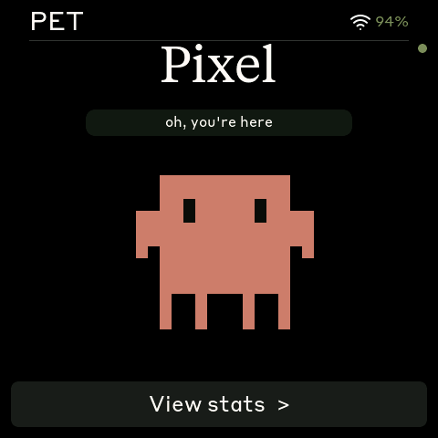
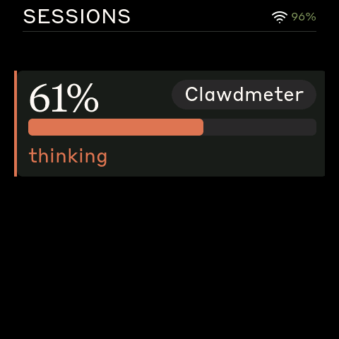
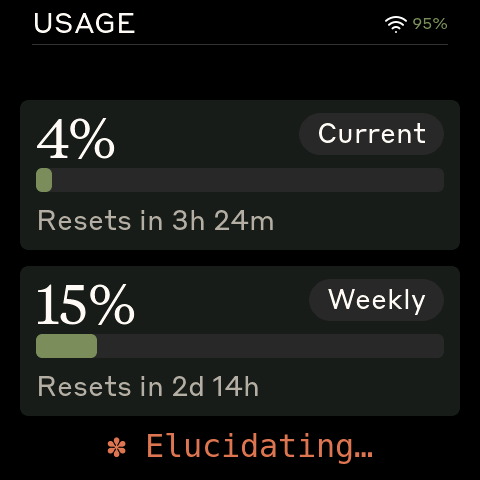
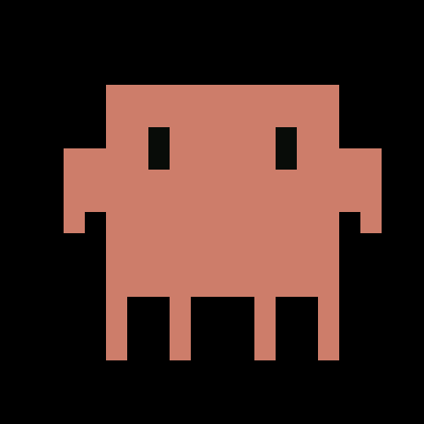
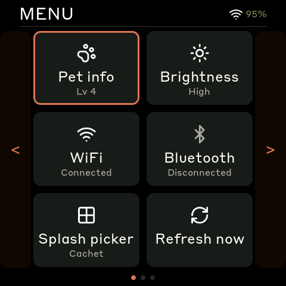
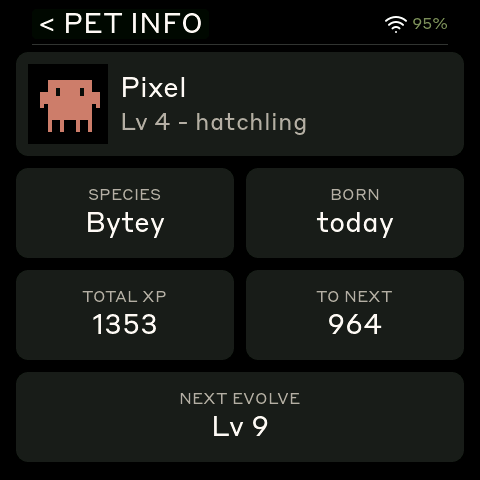
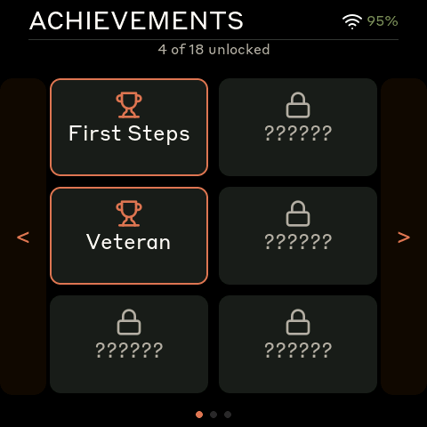
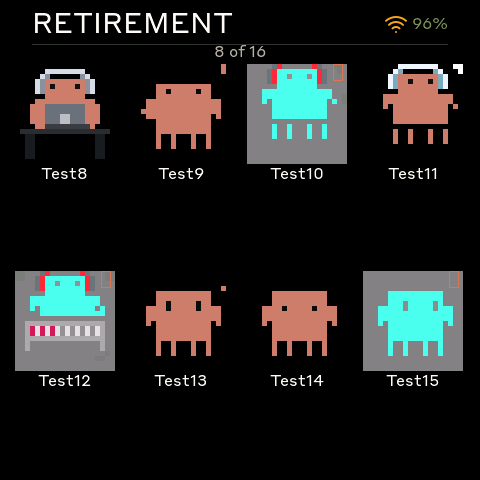
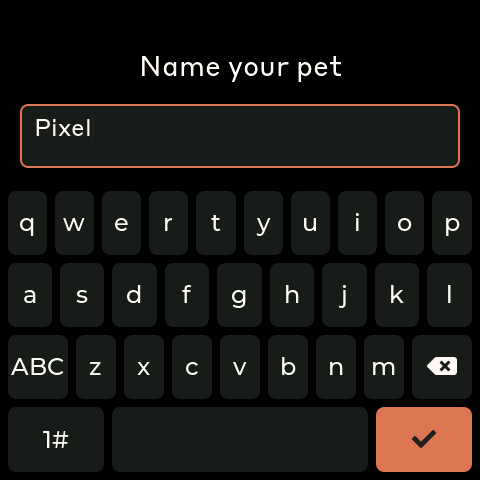

# Clawdling

**Your Claude Code usage, raised as a small digital pet.**

Clawdling lives on a desk-side AMOLED screen. It hatches when you start the daemon, levels up every time you push the API, and gets sulky if you forget to feed it. Thirteen species, all named after the words you mutter at your editor, all descended from the pixel-art Clawd creatures that wandered out of [claudepix.vercel.app](https://claudepix.vercel.app).

The dashboard meter you came for is still in here — it's just the side that shows you what your pet is eating.

|           Pet screen            |       Sessions screen        |       Usage meter        |
| :-----------------------------: | :--------------------------: | :----------------------: |
|  |  |  |

> **Naming:** the project/repo is **Clawdling**; some on-device and host identifiers still read `clawdmeter` (the daemon `clawdmeter-net.py`, the `~/.cache/clawdmeter/` state dir, the BLE service name, the first-boot SoftAP `Clawdmeter-XXXX`). Those are kept stable so existing installs don't break.

> Forked from [HermannBjorgvin/Clawdmeter](https://github.com/HermannBjorgvin/Clawdmeter). The Clawd sprites are from [claudepix](https://claudepix.vercel.app) by [@amaanbuilds](https://x.com/amaanbuilds), gently borrowed — see Credits.

---

## Meet the species

Thirteen pixel creatures, named after the words you mutter at your editor:

| #  | Name           | Vibe |
|----|----------------|------|
| 0  | **Bytey**      | Your first byte. The starter. |
| 1  | **Loopster**   | Goes in circles, productively. |
| 2  | **Forktail**   | Spawns at the slightest provocation. |
| 3  | **Mergosaurus**| Resolves conflicts with sheer mass. |
| 4  | **Patchwork**  | Held together with `sed` and prayers. |
| 5  | **Cachet**     | Keeps things close. Doesn't share. |
| 6  | **Hashling**   | Deterministic. Suspicious of randomness. |
| 7  | **Suderpus**   | Has root access. Don't ask how. |
| 8  | **Cronfox**    | Always on schedule. Always. |
| 9  | **Pickleer**   | Preserves state through anything. |
| 10 | **Sprintsaur** | Two weeks. Burnout cycle. |
| 11 | **Branchowl**  | Many paths. All of them open. |
| 12 | **Commitster** | Atomic. Squashable. Slightly chaotic. |

Each fresh hatchling is a random species, and you can name it on-device with the on-screen keyboard. When one graduates, the next rotates in. Same care mechanics, different little guy.

---

## How they grow

Two parallel loops:

**XP — fed by your Claude Code activity**

| Source                | XP                  |
|-----------------------|---------------------|
| 5-hour utilization Δ  | +10 per percent     |
| Weekly utilization Δ  | +30 per percent     |
| Per-session context Δ | +5 per percent      |

XP is multiplied by a care-stat curve from **0× (one stat at zero) to 3× (perfect care)**. Level-up resets XP to 0 — no carry-over, so a giant grant only awards one level at a time. Curve: `200·L·1.05^L`. Total to graduate ≈ 200 k XP — roughly 10–30 days of moderate use.

**Care — fed by you**

| Stat       | Decay rate            | Refilled by |
|------------|-----------------------|-------------|
| Satiety    | 100 → 0 in ~48 h      | Feed |
| Spirit     | 100 → 0 in ~48 h      | Play |
| Bond       | 100 → 0 in ~48 h      | Pet (tap the creature) |

Each action: **+25**, 2-hour cooldown. One visit a day and stats slowly die; two maintains; three+ tops everything up. Miss two days and your pet hits zero and earns no XP until you return.

The multiplier punishes neglect non-linearly: one stat below 25 → ×0.5, below 10 → ×0.25, any stat at zero → flat 0. You can't max three stats to cover a neglected one — they all matter.

---

## Lifecycle

Five evolution stages over thirty levels:

| Level  | Stage      |
|--------|------------|
| 1–3    | egg        |
| 4–8    | hatchling  |
| 9–16   | juvenile   |
| 17–29  | adult      |
| 30     | elder → **graduates** to the Retirement Home, new species rotates in |

Graduated pets live in **Menu → Retirement Home** — an animated grid of every alum; tap one for a bio card with its lifespan, total XP earned, species, and a parting quote. Up to 50 graduates before the oldest is evicted.

---

## The screens

Five top-level screens, cycled by the middle (PWR) button, all under a status bar that shows the **battery percentage** and a WiFi freshness glyph.

### Splash
The default. One creature looping its idle animation, picking a mood group based on how fast you've been hitting your quota.



### Pet
Your current creature in big format with an XP bar to the next level. Tap it (or press R) for the **Stats** sub-view — Satiety / Spirit / Bond meters with Feed / Play hooks.


### Sessions
Live list of every active Claude Code session — project name, context-fill %, and a state pill (thinking / waiting / compacting / idle). Drill into one for a bouncing Clawd whose mood matches the session.


### Usage
The meter that started it all — 5-hour and weekly utilization with reset countdowns.


### Menu
A paged tile grid (flick or use the cursor button): **Pet info, Brightness, WiFi, Bluetooth, Splash picker, Refresh now, Species Catalog, Achievements, Retirement Home, Rename pet, Vacation Mode, Speech bubbles, About, Factory reset.**



A few of the highlights:

|       Pet info        |     Achievements      |      Retirement Home      |
| :-------------------: | :-------------------: | :-----------------------: |
|  |  |  |

- **Pet info** — an identity card: hero sprite + name + level/stage over Species / Born / Total XP / XP-to-next / Next-evolve tiles.
- **Achievements** — an icon-tile grid; unlocked tiles show a trophy + name, locked ones a lock, the active weekly quest is highlighted. Tap a tile for its description.
- **Naming keyboard** — a smartwatch-style on-screen QWERTY (letters + a 123/symbols page) for naming a fresh hatchling or renaming via **Menu → Rename pet**.



---

## Hardware

Pick one:

- **Waveshare ESP32-S3-Touch-AMOLED-2.16** (480×480 square, CO5300 + CST9220 + AXP2101 + QMI8658). Three side buttons (L / M-PWR / R). Auto-rotates via the IMU. — [product page](https://www.waveshare.com/esp32-s3-touch-amoled-2.16.htm)
- **Waveshare ESP32-S3-Touch-AMOLED-1.8** (368×448 portrait, SH8601 + FT3168 + XCA9554 IO expander). Two buttons (BOOT + PWR). Fixed orientation. — [product page](https://www.waveshare.com/esp32-s3-touch-amoled-1.8.htm)

Both build from the same source tree via PlatformIO `env`s and run the same firmware with a thin board-specific HAL underneath.

---

## Installing the daemon

The daemon reads your Claude Code OAuth token from `~/.claude/.credentials.json`, makes one near-free Anthropic call a minute, and pulls the rate-limit headers off the response. Two transports — pick whichever:

### BLE (the default)

A custom GATT service; works at desk distance.

**macOS:**
```bash
./install.sh
```
Sets up a Python venv in `daemon/.venv/`, installs `bleak` + `httpx`, registers a LaunchAgent, and starts it. macOS prompts for Bluetooth permission on first run.

```bash
launchctl list | grep claude-usage
tail -F ~/Library/Logs/claude-usage-daemon.out.log
```

**Linux:**
```bash
./install.sh
systemctl --user start claude-usage-daemon
```
Status: `systemctl --user status claude-usage-daemon`. Logs: `journalctl --user -u claude-usage-daemon -f`.

Pair the device once via the Bluetooth menu drill (the MAC is shown on-device) or `bluetoothctl pair <MAC>` / `trust <MAC>`.

### WiFi (works from across the house)

A small Python daemon serves HTTPS on localhost; front it with [Tailscale Funnel](https://tailscale.com/kb/1223/funnel) for TLS + a stable URL.

```bash
./install.sh --network         # installs systemd unit, generates bearer token
./install.sh --rotate-token    # regenerate the token
tailscale funnel --bg --https=443 http://127.0.0.1:8443
```

The installer prints the bearer token — keep it; you'll enter it on the device during first-boot setup. The firmware bundles the [ISRG Root X1](https://letsencrypt.org/certificates/) cert so it validates Tailscale's Let's Encrypt edge without a CA bundle. When WiFi data is fresh (< 30 s) it preempts BLE; if WiFi drops, BLE picks up automatically.

> WiFi and Bluetooth are mutually exclusive on the ESP32-S3 radio — turning one on in its menu switches the other off.

---

## First-boot setup

No keyboard required — the device handles it via a phone-driven captive portal.

1. Boot with no config saved, or hold **BOOT** for 5 s to factory-reset.
2. It comes up as a SoftAP named `Clawdmeter-XXXX` and shows a QR code.
3. Scan with your phone → auto-joins the AP → captive portal pops up.
4. Enter WiFi SSID/password, daemon URL, bearer token. Submit.
5. Device saves to NVS, drops the AP, joins your WiFi, starts polling.

Re-do WiFi without a full reset via **Menu → WiFi → Switch** — wipes only the WiFi/daemon keys, leaving the pet and settings alone.

---

## Buttons

**AMOLED-2.16 (3 buttons):**

| Button       | Source        | Function |
|--------------|---------------|----------|
| Left         | GPIO 0        | Cycle UI back; **hold 5 s on splash to factory-reset WiFi** |
| Middle (PWR) | AXP2101 PKEY  | Cycle screens forward; on splash, cycle animations |
| Right        | GPIO 18       | Cycle UI forward; on Sessions, drill into the focused row |

**AMOLED-1.8 (2 buttons):**

| Button | Source        | Function |
|--------|---------------|----------|
| BOOT   | GPIO 0        | Cycle UI back; **hold 5 s on splash to factory-reset WiFi** |
| PWR    | XCA9554 EXIO4 | Cycle screens forward; on splash, cycle animations |

Touch is additive on both boards — flick/tap works everywhere, buttons keep doing what they did.

---

## Build / flash

```bash
# AMOLED-2.16
pio run -d firmware -e waveshare_amoled_216 -t upload --upload-port /dev/ttyACM0

# AMOLED-1.8
pio run -d firmware -e waveshare_amoled_18 -t upload --upload-port /dev/ttyACM0
```

`pio` not on PATH? Try `~/.platformio/penv/bin/pio` (Linux) or `brew install platformio` (macOS). Device path is `/dev/ttyACM0` on Linux, `/dev/cu.usbmodem*` on macOS. Both envs use [pioarduino](https://github.com/pioarduino/platform-espressif32) (Arduino Core 3.x).

---

## BLE protocol

For anyone building their own daemon:

|                                          | UUID |
|------------------------------------------|------|
| **Data Service**                         | `4c41555a-4465-7669-6365-000000000001` |
| RX Characteristic (write)                | `4c41555a-4465-7669-6365-000000000002` |
| TX Characteristic (notify)               | `4c41555a-4465-7669-6365-000000000003` |
| REQ Characteristic (notify on subscribe) | `4c41555a-4465-7669-6365-000000000004` |

JSON payload (written to RX):

```json
{
  "s": 45, "sr": 120, "w": 28, "wr": 7200, "st": "allowed", "ok": true,
  "ses": [
    {"id": "cc04afb8", "n": "CRM (multi-action)", "c": 71, "st": "w", "a": 3}
  ]
}
```

Fields: `s` = 5h %, `sr` = 5h reset (min), `w` = weekly %, `wr` = weekly reset (min), `st` = status, `ok` = success, `ses` = up to 6 sessions (`id` = 8-char prefix, `n` = name, `c` = ctx %, `st` = `t`hinking/`w`aiting/`c`ompacting/`i`dle, `a` = seconds since activity).

---

## What's new vs. upstream

Forked from [HermannBjorgvin/Clawdmeter](https://github.com/HermannBjorgvin/Clawdmeter):

- **The pet system** — XP curve, care stats, 13 species, evolution, graduation, Retirement Home. The point of the fork.
- **AMOLED-1.8 board port** with a HAL refactor (per-board folders) so a third port can drop in without touching shared code.
- **Sessions screen** — per-project Claude Code session view with drill-in.
- **WiFi / HTTPS transport** as a peer to BLE, with a Python daemon + Tailscale Funnel front-end, and phone-paired first-boot provisioning (SoftAP + captive portal + on-device QR).
- **UI polish pass** (latest) — battery **percentage** in the status bar; a smartwatch-style **on-screen keyboard** for pet naming; **Achievements** as a readable icon-tile grid; a redesigned **Pet info** identity card; **WiFi/Bluetooth** info as grouped status cards; the duplicate "Past Pets" list folded into **Retirement Home**; Sessions/Usage card alignment.
- **Performance + bug sweep** — HTTPS poll on a dedicated FreeRTOS Core-0 task, portMUX guards on BLE/touch shared state, LVGL leak + stack-safety fixes.
- The original **BLE HID keyboard** (Space / Shift+Tab passthrough) was removed during the sweep. If you used it, stay on upstream.

---

## Recompiling fonts / icons / splash sprites

The tooling lives in `tools/`:

- **Icons:** `node tools/png_to_lvgl.js <input.png> <symbol> [W] [H] [--tint=RRGGBB | --no-tint]`. Default tint is white (Lucide PNGs ship black-on-transparent).
- **Splash sprites:** `node tools/scrape_claudepix.js && node tools/convert_to_c.js` to re-pull from claudepix.
- **Fonts:** `lv_font_conv` + the LVGL 9 patches in [docs/porting/](docs/porting/). Note: the firmware ships pre-compiled bitmap glyph subsets; the raw brand-font files are **not** included in this repo (see below).

---

## Credits

- Pixel-art Clawd sprites by [@amaanbuilds](https://x.com/amaanbuilds), from [claudepix.vercel.app](https://claudepix.vercel.app).
- [Lucide](https://lucide.dev) icons (MIT).
- [HermannBjorgvin/Clawdmeter](https://github.com/HermannBjorgvin/Clawdmeter) for the original device and firmware.

## Licensing note

This is a hobby project with mixed provenance: it builds on the upstream fork, renders the **Clawd mascot** (Anthropic), and ships **bitmap glyph subsets** derived from commercial brand fonts (Tiempos Text, Styrene B). The raw font files and the Anthropic logo are **not** included here, but the package as a whole is **not** offered under a permissive open-source license — it's published source-available. If you fork or redistribute, you're responsible for the rights to those third-party assets.
